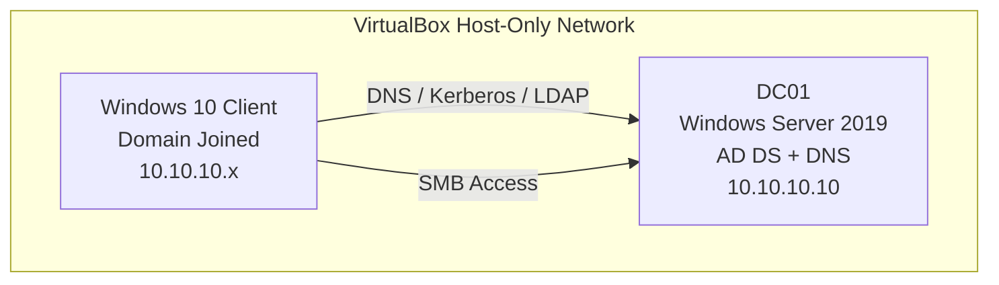

# Active Directory Identity & Access Management Lab

## 1. Overview
This project is a hands-on Identity & Access Management lab built in a local virtualized environment using Microsoft Active Directory.

The lab simulates a small enterprise identity infrastructure and demonstrates core IAM concepts, including:

- Active Directory Domain Services (AD DS)
- DNS-based identity service discovery
- Kerberos authentication
- Role-Based Access Control (RBAC)
- AGDLP group nesting
- NTFS permission assignment
- Group Policy enforcement
- Identity lifecycle actions such as provisioning and access revocation

This project was built to demonstrate practical identity administration and access control concepts used in enterprise Windows environments.

---

## 2. Current Lab Architecture

### Environment
- **Virtualization Platform:** Oracle VirtualBox
- **Network Type:** Host-Only Adapter
- **Domain Name:** `treasury.local`

### Systems
| System | Role | OS | IP Address |
|--------|------|----|------------|
| DC01 | Domain Controller | Windows Server 2019 | 10.10.10.10 |
| Windows 10 Client | Domain-Joined Workstation | Windows 10 | 10.10.10.x |

### Server Roles Installed on DC01
- Active Directory Domain Services (AD DS)
- DNS Server

The Windows 10 client was configured to use the Domain Controller as its DNS server, enabling domain join, Kerberos authentication, and Active Directory service discovery.

---

## 3. Network Diagram



---

## 4. Active Directory Structure

### Organizational Units
```text
treasury.local
│
├── Corp-Admins
├── Corp-Computers
├── Corp-Groups
│   ├── Distribution
│   └── Security
│
└── Corp-Users
    ├── OEE
    ├── IT
    ├── ABCC
    ├── MSRB
```

### Example Users
- `dkim`
- `jsmith`

### Security Groups

#### Global Groups
- `GG_OEE_Employees`
- `GG_OEE_Managers`

#### Domain Local Groups
- `DL_OEE_Share_Read`
- `DL_OEE_Share_Modify`

This structure was used to model departmental access and role-based authorization.

---

## 5. RBAC and AGDLP Access Model

The lab implements Role-Based Access Control using the AGDLP model:

**Accounts → Global Groups → Domain Local Groups → Permissions**

### Example Access Path
```text
dkim
↓
GG_OEE_Employees
↓
DL_OEE_Share_Modify
↓
NTFS Permission
↓
\\DC01\oee
```

This design ensures users do not receive permissions directly. Access is assigned through group membership, following Microsoft best practice.

---

## 6. File Share and Access Control Validation

### Shared Resource
- **Share Path:** `\\DC01\oee`
- **Local Folder:** `C:\TreasuryShares\OEE`

### NTFS Permissions
- `DL_OEE_Share_Read` → Read
- `DL_OEE_Share_Modify` → Modify
- `Domain Admins` → Full Control

### Access Control Tests Performed
- Authorized user successfully accessed the share
- Unauthorized user received **Access Denied**
- Removing a user from the security group revoked access
- Re-adding the user restored access

These tests validated that authorization was working correctly through group membership and NTFS permissions.

---

## 7. Kerberos Authentication Validation

The lab uses **Kerberos** as the authentication protocol for Active Directory.

Authentication was validated on the Windows 10 client using:

```powershell
klist
```

### Tickets Observed
- `krbtgt/TREASURY.LOCAL`  
  - Ticket Granting Ticket (TGT) issued at logon
- `cifs/DC01`  
  - Service ticket issued after accessing the SMB share

### Authentication Flow
```text
User logs into domain-joined workstation
↓
Domain Controller validates credentials
↓
TGT issued
↓
User requests service ticket
↓
CIFS ticket issued
↓
User accesses \\DC01\oee
```

This confirmed that Kerberos authentication was functioning correctly in the lab.

---

## 8. Group Policy Configuration

The lab uses the **Default Domain Policy** to enforce baseline domain security settings.

### Configured Policies
- Minimum password length
- Password complexity requirements
- Account lockout threshold
- Lockout duration

These settings apply domain-wide and provide baseline account security controls.

---

## 9. Security Logging

Security logging was partially implemented to support identity-related visibility.

### Configured Logging
- Advanced Audit Policy
- Logon events
- Process creation events
- Event ID `4688`

PowerShell logging was also part of the broader lab discussions and detection work.

---

## 10. Identity Lifecycle Actions Simulated

The lab also demonstrated basic identity lifecycle scenarios.

### Joiner
- Created users such as `dkim` and `jsmith`
- Assigned users to department-aligned groups

### Mover
- Changed group membership to reflect access changes

### Access Revocation / Restoration
- Removed a user from a group and verified access was revoked
- Re-added the user and verified access was restored

This simulated real IAM provisioning and deprovisioning behavior.

---

## 11. Validation Summary

The current lab successfully demonstrates:

- Active Directory deployment
- DNS configuration for identity services
- Domain join functionality
- Organizational Unit design
- Security group administration
- RBAC through AGDLP
- NTFS permission assignment
- Kerberos authentication validation
- Group Policy-based security controls
- Identity lifecycle simulation

---

## 12. Project Documentation

Detailed project notes are available here:

- [Lab Architecture](docs/architecture.md)
- [Active Directory Configuration](docs/active-directory.md)
- [Kerberos Validation](docs/kerberos-validation.md)
- [RBAC and Access Control](docs/rbac-and-access-control.md)
- [Group Policy Configuration](docs/group-policy.md)
- [Security Logging](docs/security-logging.md)

---

## 13. Resume Value

This project demonstrates hands-on experience with:

- Active Directory administration
- Identity and access management
- Kerberos authentication
- RBAC design
- Group Policy
- Access control validation
- Windows enterprise identity infrastructure
